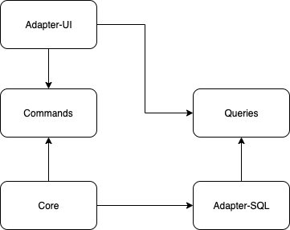

## 2019/11/11 - Choices of updating the TestBuilder API or not: result
The choice to keep the API as is, wouldn't work, because you cannot change the id fields of instances of course, you dummy.

The other thing I noticed though, is that instead of having your compiler tell you something is wrong and needs fixin', it'll be the tests that tell you this.

So the conclusion is: whenever your construction of a domain object changes, your test builder should change API along with it.

## 2019/11/11 - Choices of updating the TestBuilder API or not
While redesigning `addCompetitor` to use just competitor names instead of `Competitor`s:

`Competition.defaultCompetitionForTest` used to have `competitors` which were actual `Competitor`s, but I chose to change that API to `CompetitorName`s instead.

This had the implication of having to change all usages in tests, which was tedious, but also allowed me to double check if whatever use-case was happening there, was still the thing I wanted. 

The other choice, was to keep the API as is, but _internally_ (in the TestBuilder function) translate the `Competitor`s into `CompetitorName`s **and** also set the expected UUIDs.

Let's find out which one was the better choice by doing the same with `addChallenge`.

## 2019/11/11 - Gradual redesign does not always allow _optimal explicitness_
For example, when having `addCompetitor` use a newly introduced `CompetitorName` wrapper, I ran into the fact that I can't just change `Competitor` itself.
Because the UI still depends on `Competitor` being some object that is instantiatable by Jackson. I wanted to introduce a new constructor that takes a `CompetitorName` and returns a `Competitor`.

## 2019/11/11 - Commands risks to become a garbage bin
Right now, I chose to put common wrapper classes (like `CompetitorName` or `ChallengeToAdd`) in the `commands` _module_.

But that means that to get typesafety (or the same rules) in for example the `query` _module_, that module would also need to depend on `commands`.

And that seems like an unreasonable dependency. So maybe I need something like a shared types module?

## 2019/11/3 - Options for choosing where Transactionality lies
Problem when adding multiple Challenges to an existing Competition: when one of the Challenges is invalid, none of the challenges should be added.

Added a ScenarioTest for this, and put `@Transactional` on the `CompetitionController.addChallenges` method, but not sure how I feel about that.

Because I think, ideally, I have my `CommandExecutor.execute` be the transaction boundary, because it implicitly is the consistency boundary of my _aggregates_.
The reason for that being that Commands get executed on an Aggregate.

If I then add an `AddChallenges` (note: multiple) command, the Competition should be consistent after execution of adding multiple Challenges. 

## 2019/10/20 - New Convention: non-optional Query types should throw EntityNotFound exceptions
Made finding an exact Competition and "maybe" finding one explicit:

There was some duplicate code in `findOrThrow` that I first tried to extract into an abstract CompetitionCommandHandler, but then it occurred to me that it might be more explicit if I put it in the Query Type: `MaybeFindCompetition` and `FindCompetition`. So now the convention is, if you try to execute a query that expects a non optional type (e.g.: `Competition`) and it couldn't be found, the QueryHandler is supposed to throw an `EntityNotFoundDomainException`. If it **is** a non optional type (e.g.: `Competition?`), then the convention is the QueryHandler is supposed to **not** throw that exception and instead just return the optional result.

## 2019/10/14 - Deploying CQRS-backend now + Spiel try-out
To both Heroku (by uncommenting `execJava` stuff in the Dockerfile and pushing to `prod` branch) and Kubernetes (by locally building a new image and pushing to rotate-it docker registry and `kubectl apply`ing).

Going to try and run a Competition for our upcoming long weekend at Spiel in Essen, Germany.

## 2019/09/28 - Start of moving to CQRS
`Command and Query Responsibility Segregation`

Plan of attack:
See [issue #58](https://github.com/SoftwareSandbox/effit-challenge/issues/58)

**Notes**:

Copied `effit-backend` to `effit-cqrs-backend` so I can continuously refer to both architectures on stream.

An important in-between step was to just move logic in controller functions straight into the CommandHandlers, and only in a later stage move that to actually applying those Commands to the Aggregates.

Check out the module dependency diagram:




## 2019/08/21 - GitHub Actions learnings

Tutorial worked great! 

Defined a workflow in `main.yml`.

Workflow > Jobs > Builds > Steps

A `step` can (re-)use an `Action`.

### Questions!
### Q1
How do I trigger workflows, jobs, or steps conditionally based on a branch?

Having multiple .yml files in .github/workflows doesn't seem to work. (no additional workflows are listed in actions menu).

Googling stuff like that is horrible because you end up with results on _GitHub Flow_ or projects, but not _GitHub Actions Workflows_.

### Q2
Does `${{ secrets.SECRET }}` get shown (not asterisked) when you `EXPORT sekret = ${{ secrets.SECRET }}` it?

I (think I) need that because those ${{}} substitution doesn't get done when you `- run: ./someScript.sh`.

### Q3
Where can I find what the `github` context entails? I've been looking for docs, but can't find any. Is it just the webhook event?

### Q4
Add feature request to also asterisk GitHub secrets values (to be streamer friendly).

### Q5
Try out Java 12 version of the java action.

## 2019/08/03 - K8s learnings
Deployments: some runtime for an application or service (a deployment really is a composition of a pod and a replica set).

Services: A Service is a layer required for service discovery, allows discovering a deployment within the Kubernetes Cluster.

Pods: For example my stateless web application, multiple containers can be run in one pod.

Operators: Considered as the _glue_ between kubernetes and an app or service (e.g. postgres), usually supplied by developer communities (like zalando) 

Ingress: Mainly functions as an http proxy for services. Based on NGINX. 

## 2019/08/01 - Reverted decision to NOT cascade Challenges when saving a Competition
Because I'm too stupid and too lazy to extract **deletion** of challenges on a competition outside of the competition.

It'll be reworked when I switch to CQRS instead of an anemic domain model anyway (and I can't be bothered right now).

## 2019/07/29 - TIL to use computed getters and setters instead of watch expressions
I used it to update the endDate when the startDate was updated in CreateCompetition:
```
set startDate(newDate: string) {
    this.backedStartDate = new Date(newDate).toISOString().substr(0, 10);
    this.endDate = new Date(newDate).toISOString().substr(0, 10);
}

get startDate() {
    return this.backedStartDate;
}
```

Also [read the docs](https://vuejs.org/v2/guide/computed.html#Computed-vs-Watched-Property).


## 2019/07/29 - Don't catch(noop) in axios.post
Was fixed by throwing errors in the BaseSnackbar component.

This actually caused success notifications to override the error notifications.

## 2019/07/15 - FINALLY was able to use TravisCI to deploy our webapp :tada:

This didn't go as easy as I planned. Most important thing that changed since last time I deployed a docker container on Heroku is the _Release Phase_ they added.

### Problem the first: Executing release phase on TravisCI
Where before I could just push a docker image to the Heroku registry, and Heroku would just start that one up, now it needs extra motivation.

The only way to give Heroku that motivation is to tell it to actually release, by either:

`heroku container:release web -a effit-challenge`

or by using the so called _API_, which is what we're using on a successful `prod branch` build on TravisCI.

See the `after_success:` step in the [.travis.yml](.travis.yml) file.

### Problem the second: parsing the `$DATABASE_URL` string that Heroku passes to the container
Heroku is able to pass `$SPRING_DATASOURCE_URL` stuff, but **only** when it's able to identify the app is running springboot, which it can't when it's a docker container...

So instead, I needed to parse the `$DATABASE_URL` environment variable. Luckily, somebody else also experience my misery and [fixed his](https://gist.github.com/wwerner/66ee4b1050bd5824dcfd9a5e0cd07f12#file-heroku-db-url-to-spring-boot-sh-L18).

See [execJava.sh](ops/webapp/execJava.sh)'s contents on how that parsing actually happens.

### Locally checking Heroku server logs
`heroku logs -a effit-challenge --tail`


## 2019/06/15 - Made competitors into a MutableList because of Hibernate

`private var _competitors: MutableList<Competitor> = mutableListOf()`

Because Hibernate will lose its reference to the `_competitors` if you do `_competitors = _competitors - competitorToBeRemoved` instead of `_competitors.remove(competitorToBeRemoved)`.

It's still OK (I guess), because it only remains mutable within `Competition`.

## 2019/06/01 - TIL about `In Component Navigation Guards`
See this [helpful article](https://router.vuejs.org/guide/advanced/navigation-guards.html#in-component-guards).

I used this to navigate to the 404 page, when a requested competition detail couldn't be found, from inside a component. Because the route `/competition/:competitionid/sub-page` would still get matched to a component.

## 2019/06/01 - TIL to actually throw an Error from an Axios interceptor on Reject
Otherwise, the Promise chain won't be broken, and all `.then()`'s and `.catch()`'s will be called.

I noticed this when I wasn't getting the expected error message when completing a challenge twice for the same competitor.

VueX was helpful in showing that there were actually two showSnackbar events, but the error got overridden with the success message.

This was working accidentally in the CreateCompetition.vue, because I was doing something with the response's location header.  
Which doesn't exist on an error http status, and runtime would explode, causing the error to be thrown, and interrupting the Promise chain from the CreateCompetition component, instead of from the Interceptor.

Fixed it by throwing an error from the Interceptor.


## 2019/06/01 - TIL to be careful with data class equality checks and private var's outside of constructor
Because any property **outside** of the constructor won't be used in the equality check!

This looks _duuuh_, but it's actually quite easy to make a mistake against this.

## 2019/05/26 - Added @JsonSetter to private props to fix `Operation is not supported for read-only collection`
Since I want to encapsulate adding Challenges or Competitors to a Competition's respective relations, I provided immutable getter functions.

Jackson, however, thinks it needs to use those getter functions to **set** array values when reading from a JSON string.

Fixed by adding `@JsonSetter` to the private props:

```
@JsonSetter("challenges")
    private var _challenges: List<Challenge> = emptyList()
@JsonSetter("competitors")
    private var _competitors: List<Competitor> = emptyList()
```

By doing that, I was able to finally get rid of jsonPath expressions in the ScenarioTests!!!!!!!!!!!!!!

## 2019/05/19 - Controller mock tests insights
My controllers are acting as a service layer, and I am feeling the pain of using mocks, because my test are tightly coupled with my implementation.

It might be better to **only** test erroneous cases (like 404's and such), and write integration tests for actual behavior.


## 2019/05/05 - Returning proper error messages on backend exceptions
### Use a SpringBoot ExceptionHandler
Pros:
* Exception transformation, which is generic for all controller exposed functions, is extracted in to one place

Cons:
* _A developer needs to know_ that Exceptions are handled in this ExceptionHandler.
* Need for runtime exceptions

### Wrap domain logic in a Result type
Pros:
* Exception transformation is explicit and in the correct place

Cons:
* Boilerplate code, taking away from what's interesting to the controller
* Needs to happen in every controller exposed function (easy to forget)

### Conclusion
I went with the ExceptionHandler, mainly because I want my controller logic to contain only the most interesting bits.

## 2019/05/05 - @get:JsonIgnore Fixes deserialization error 
Exception I was getting during the CreatingCompetition Scenario test:

```
com.fasterxml.jackson.databind.JsonMappingException: Operation is not supported for read-only collection (through reference chain: be.swsb.effit.competition.Competition["challenges"]->kotlin.collections.EmptyList[0])

	at com.fasterxml.jackson.databind.JsonMappingException.wrapWithPath(JsonMappingException.java:394)
	at com.fasterxml.jackson.databind.JsonMappingException.wrapWithPath(JsonMappingException.java:365)
	at com.fasterxml.jackson.databind.deser.std.CollectionDeserializer.deserialize(CollectionDeserializer.java:302)
	at com.fasterxml.jackson.databind.deser.std.CollectionDeserializer.deserialize(CollectionDeserializer.java:27)
	at com.fasterxml.jackson.databind.deser.impl.SetterlessProperty.deserializeAndSet(SetterlessProperty.java:133)
	at com.fasterxml.jackson.databind.deser.BeanDeserializer.deserialize(BeanDeserializer.java:252)
	at com.fasterxml.jackson.databind.deser.BeanDeserializer._deserializeUsingPropertyBased(BeanDeserializer.java:441)
	at com.fasterxml.jackson.databind.deser.BeanDeserializerBase.deserializeFromObjectUsingNonDefault(BeanDeserializerBase.java:1287)
	at com.fasterxml.jackson.databind.deser.BeanDeserializer.deserializeFromObject(BeanDeserializer.java:326)
	at com.fasterxml.jackson.databind.deser.BeanDeserializer.deserialize(BeanDeserializer.java:159)
	at com.fasterxml.jackson.databind.ObjectMapper._readMapAndClose(ObjectMapper.java:4013)
	at com.fasterxml.jackson.databind.ObjectMapper.readValue(ObjectMapper.java:3004)
	at be.swsb.effit.scenariotests.CreatingCompetitionsScenarioTest.retrieveCompetition(CreatingCompetitionsScenarioTest.kt:57)
	at be.swsb.effit.scenariotests.CreatingCompetitionsScenarioTest.Challenges should get copied when being added to a Competition(CreatingCompetitionsScenarioTest.kt:45)
	...
	at com.intellij.rt.execution.junit.JUnitStarter.main(JUnitStarter.java:70)
Caused by: java.lang.UnsupportedOperationException: Operation is not supported for read-only collection
	at kotlin.collections.EmptyList.add(Collections.kt)
	at com.fasterxml.jackson.databind.deser.std.CollectionDeserializer.deserialize(CollectionDeserializer.java:290)
	... 50 more
```

This would occur at run-time if we'd try to POST a Competition **with** Challenges, which in reality we never do, so...

Fixed and documented!

## 2019/05/05 - Decided not to deal with broken encapsulation of Challenges when adding them to a Competition
POST'ing to : `/api/competition/{competitionId}/addChallenges`, with Challenges that happen to already exist in the database, would in fact override the existing Challenges.

Since our UI is the only consumer of our own REST API, and our UI does not pass Challenge UUID's to addChallenges, this isn't an actual problem.

Let's hope I never accidentally pass existing Challenge UUID's to this REST API controller.

## 2019/05/05 - Deciding to NOT cascade Challenges when saving a Competition
Just so saving a Competition does not accidentally save (updates to) Challenges along with it.

It brings along some more boilerplate, but it's more explicit this way.

## 2019/04/14 - Came to the painful conclusion that a Competition will never be created by a person without having any start or end date
And only noticed that after I created the UI page for creating a Competition.

Unit Testing the constructor didn't trigger my brains to think about how a person would actually want to create a Competition when faced with a UI for it.

Maybe when I come up with another concept that a user can _create_ manually, I'll start by creating a UI page for it.

## 2019/04/14 - Avoid using mutated properties in components

Warning message we get from Vue:
```
[Vue warn]: Avoid mutating a prop directly since the value will be overwritten whenever the parent component re-renders. 
Instead, use a data or computed property based on the prop's value. 
Prop being mutated: "model"
```

Vue has single-way binding. To update parent components, use `@input="emitOnInput"` instead.  
This causes the value to propagate back to the parent, and then because of `v-bind` (or `v-model`) update the child's value again.

## 2019/04/13 - Having Jackson automagically create a new UUID for a Challenge is juuuuuust fine.
At least for now.

There **is** a typealias for when I need to actually use that type instead of just using a `Challenge`.

## 2019/04/13 - Fixing repository mocks in ControllerTests
`@WebMvcTest(controller = SomeController::class)` would still try to create beans for JpaRepositories, and consequently fail on trying to find an entityManager.

I fixed it before by manually providing `@MockBean`s for unused repositories, but that would expand quite fast into duplicate `@MockBean` fields in tests.

I tried using `excludeAutoConfig...` which didn't work T_T

Eventually provided my own `@ContextConfiguration` for tests, that lists all repositories as `@MockBean`s, so I only have to do that once.

I also needed to have that configuration actually scan my Controller classes.

The remaining `@WebMvcTest` is now only used to setup `MockMvc`.

Mocking repositories that are used in ControllerTests now works by simply `@Autowired`ing the needed collaborating repositories.


## 2019/04/13 - backing properties on Jpa classes determine JpaRepository convention functions
For backing property:
```
@Embedded
private var _competitionId: CompetitionId
```
The convention function would look like:
```
fun findBy_competitionId(competitionId: CompetitionId): Competition?
```

IF you're lucky, Spring will try and suggest which backing property you meant when writing the convention function.
If not, you end up getting an exception that looks like:
```
Caused by: org.springframework.data.mapping.PropertyReferenceException: No property competitionIdentifier found for type Competition!
```

Where `competitionIdentifier` relates to the name in the convention function you wrote.

## 2019/04/11 - Use router-link instead of @click="router.push()"
`<router-link>` has a `tag` attribute that replaces the element with that tag:
```
<router-link to="/challenges" tag="v-list-tile">
```

## 2019/04/11 - Backing properties
To make sure exposed lists are not mutable externally, provide backing property like so:

```
private var _challenges: List<Challenge> = emptyList()
val challenges: List<Challenge>
    get() = _challenges
```

## 2019/04/07 - JUnit 5 to the rescue
Using JUnit 5 did help fix our problem with configuration loading...

## 2019/04/06 - @AutoConfiguration misery
Somehow tests are loading beans defined in separate configuration classes.

We'll try to use JUnit instead of kotlin-test to get that fixed. :pray:

## 2019/04/06 - No-arg plugin not working?
Had to manually add default constructors to fix our RepositoryIntegrationTest T_T

Really need to resolve this issue!

## 2019/04/06 - Using functional package names instead of technical ones

## 2019/04/06 - WebMvcTest vs. SpringBootTest
`@SpringBootTest` requires your test `@Configuration` to be in a separate class (probably because of initialization order).

`@WebMvcTest` can interpret localized `@TestConfiguration` classes, but requires you to define your _Controller under test_ in the annotation itself.

## 2019/04/06 - (Modular) Monolith
Because I want to prove to myself that starting out from a monolith should not necessarily mean I get stuck in that architecture.

## 2019/04/06 - Started this project
Live streaming on https://twitch.tv/sch3lpsc2
